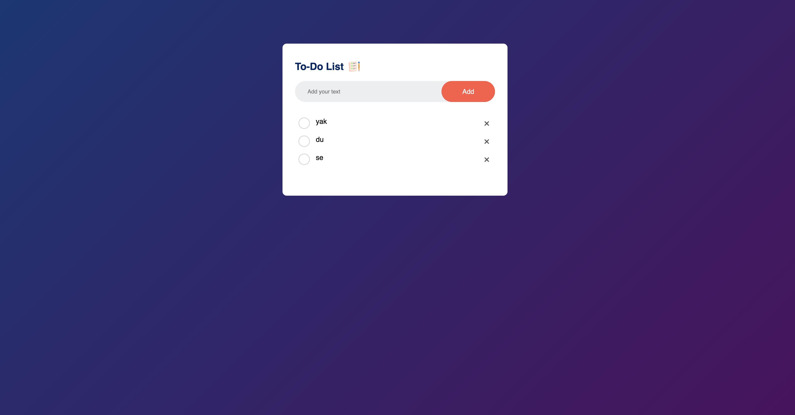

# To-Do-List main page

> This repository consists of making a clone of a To-Do-List. old main page.

## Build With

- HTML,
- CSS
- JS

## Live Demo

[Live Demo Link](https://shaxa98.github.io/To-Do-List-/)

**Deployment**:+1:

- \*_The page is very straightforward, so you should be able to clone it even if your CSS skills aren’t perfect. As usual, don’t worry about any of the dynamic functionality on the page or finding the specific icons they use or having the form actually submit. The point is to make it look like the real page as much as you reasonably can_

**npm run** to run server and page will be rendered automatically to Mozilla Developer Browser.

- Before to run you need to install all dependency by

**npm i** or **npm install**

## Author

👤 **Shakhzod Akhrorov**

- Github:[@shaxa98](https://github.com/shaxa98)
- Linkedin:[@Shakhzod AKhrorov](https://www.linkedin.com/in/shakhzod-akhrorov/)

## 🤝 Contributing

**Contributions, issues and feature requests are welcome!**
Feel free to check the [issues page](https://shaxa98.github.io/To-Do-List-/) .

## Show your support

Give a ⭐️ if you like this project!

## Acknowledgments

- Hat tip to anyone whose code was used
- Inspiration etc.
